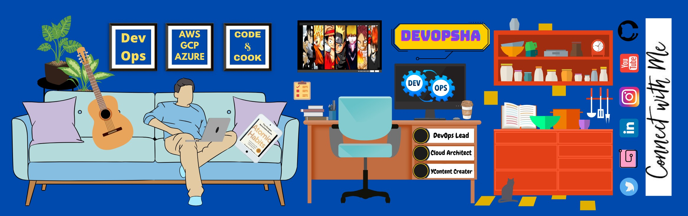

   •  
    •
<!--   <a href="#">Blog</a> •
  <a href="#">Twitter</a> •
  <a href="#">Work README</a> •
  <a href="#">Projects</a> -->

Here are some ideas to get you started:

- 🔭 I’m currently working on html, CSS, JS, .NET
- 🌱 I’m currently learning CSS
- 👯 I’m looking to collaborate on Web Developement
- 🤔 I’m looking for help with Web Developement and Website hosting Collab
- 💬 Ask me about Anything
- 📫 How to reach me: MailMe: sdtiurwadkar@gmail.com

 

 
 

 
